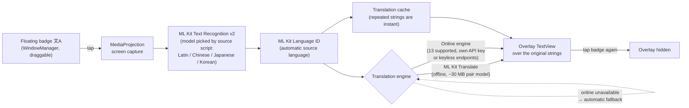
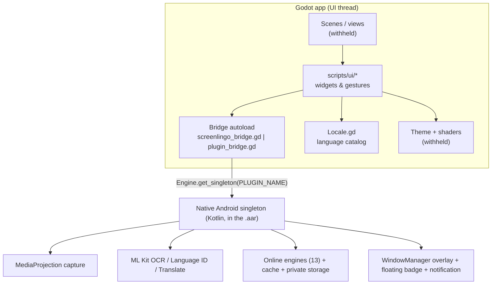

# ScreenLingo

**On-screen, real-time translation for Android games and apps** — capture the screen, recognize the text, detect its language, translate it and draw the result right on top of the original, without leaving the game. Touches pass straight through the translation layer.

[](https://godotengine.org)
[-3ddc84.svg?logo=android&logoColor=white)](https://www.android.com)
[](https://docs.godotengine.org/en/stable/tutorials/scripting/gdscript/)
[](LICENSE)
[](LICENSE-ARR)
[-orange.svg)](#4-repository-status-what-is-here-and-what-is-intentionally-missing)

> ### ⚠️ Important: this repository is a code showcase
>
> This is **not a runnable project**. `project.godot`, all scenes (`.tscn`), themes, shaders, icons, fonts, the native Gradle module and the compiled `.aar` binaries have been deliberately removed to protect intellectual property. What remains — GDScript sources, the localization catalog, the export plugins and the build tooling — is published **for code review, portfolio and educational purposes only**.
>
> You can read, study and critique the architecture, but you cannot open this repository in Godot and press *Play*. See [Repository status](#4-repository-status-what-is-here-and-what-is-intentionally-missing) for the exact inventory.

---

## Table of contents

1. [What ScreenLingo is](#1-what-screenlingo-is)
2. [How it works — the translation pipeline](#2-how-it-works--the-translation-pipeline)
3. [Feature overview](#3-feature-overview)
4. [Repository status: what is here and what is intentionally missing](#4-repository-status-what-is-here-and-what-is-intentionally-missing)
5. [Repository layout](#5-repository-layout)
6. [Architecture](#6-architecture)
7. [The bridge autoload — full API reference](#7-the-bridge-autoload--full-api-reference)
8. [Locale registry (`scripts/Locale.gd`)](#8-locale-registry-scriptslocalegd)
9. [UI component library (`scripts/ui/`)](#9-ui-component-library-scriptsui)
10. [Native Android integration (`addons/`)](#10-native-android-integration-addons)
11. [Localization pipeline (`assets/i18n/`)](#11-localization-pipeline-assetsi18n)
12. [Tooling (`tools/`)](#12-tooling-tools)
13. [Building a real app out of this](#13-building-a-real-app-out-of-this)
14. [Placeholders, redactions and naming rules](#14-placeholders-redactions-and-naming-rules)
15. [Coding conventions](#15-coding-conventions)
16. [Privacy and security model](#16-privacy-and-security-model)
17. [Visual language (for asset replacement)](#17-visual-language-for-asset-replacement)
18. [Extending the app — recipes](#18-extending-the-app--recipes)
19. [Known gaps and possible next steps](#19-known-gaps-and-possible-next-steps)
20. [FAQ](#20-faq)
21. [License and credits](#21-license-and-credits)
22. [Contributing and contact](#22-contributing-and-contact)

---

## 1. What ScreenLingo is

ScreenLingo is an Android application that translates text **over other apps**. Typical use case: a Japanese-only mobile game, a Chinese MMO, a domestic app with no localization — you tap a small floating button, and one second later translated strings are painted exactly where the original text sits.

The app itself is a Godot 4 project (UI layer) plus a native Android plugin (capture, OCR, translation, overlay window). The Godot part owns everything the user sees and touches; the Kotlin/Android part owns everything that requires platform APIs.

**Why a game engine for a utility app?** The interface is fully custom-drawn — paper sheets, folded corners, origami animations, hand-tuned gesture handling — and Godot gives a portable, expressive toolchain for exactly that kind of bespoke UI, while the Android plugin supplies the parts Godot does not expose as comfortably (MediaProjection capture, ML Kit, `WindowManager` overlays, foreground services).

### Target platforms

| Platform | State in this codebase |
| --- | --- |
| Android (arm64, Godot 4.6.3, JDK 17) | The real target. Everything in the native plugin and the export add-ons is Android-only. |
| Windows / macOS / Linux desktop | Debug-only. Without the native singleton the bridge runs on an in-memory fallback store so the whole UI can be exercised and screenshotted in the editor (see [`tools/ui_snapshot.gd`](#ui_snapshotgd--headless-ui-snapshot-harness)). |
| iOS / Web | Not supported: the pipeline depends on MediaProjection, ML Kit and system overlay windows. |

---

## 2. How it works — the translation pipeline



**Stage by stage**

1. **Capture.** The screen is grabbed via `MediaProjection` **only at the moment you tap** — there is no continuous recording, no background screenshot loop. Android asks for explicit capture consent the first time.
2. **Recognition.** Google ML Kit Text Recognition v2 runs OCR on the captured bitmap. Which model is used depends on the **source script** setting (Latin / Chinese / Japanese / Korean — the CJK models also cover Latin text, hence the “+ Latin” hints in the UI). All recognition models are bundled and work offline.
3. **Language identification.** ML Kit Language ID determines the source language automatically; the target language is the one picked in Settings.
4. **Translation.** Either on-device ML Kit Translate (offline, a per-language-pair model of roughly 30 MB is downloaded once) or one of the online engines. If an online engine is unavailable, ML Kit is used automatically as the fallback.
5. **Composition.** Each recognized text block is drawn as an overlay item positioned over the original string. The overlay window is *not* touchable: gestures pass through to the game underneath, so you keep playing while reading the translation.
6. **Caching.** Recognized/translated strings are cached, so repeated UI labels (menus, HUD, dialog buttons) reappear instantly on the next tap. The cache can be cleared from the *More* tab.

The **floating badge** communicates state without any extra UI:

| Badge glyph | Meaning |
| --- | --- |
| `文A` | Idle — ready to translate |
| `…` | Capture + recognition in progress |
| `✕` | Translation is currently displayed; tapping hides it |

The badge is draggable anywhere on screen, hides itself during the capture so it never pollutes the screenshot, and its size (0.75×–1.5× of a 54 dp base) and idle opacity (0.4–1.0) are user-configurable.

---

## 3. Feature overview

**Translation**
- 13 translation engines behind one constant-based identifier scheme (see the [engine table](#engine-identifiers)).
- Offline ML Kit Translate with a ~30 MB per-pair model, plus keyless online endpoints (Google web, MyMemory) and LLM engines that translate the whole screen at once, with context and game terminology in mind.
- Automatic fallback to ML Kit when an online engine fails.
- Translation cache for instant repeat lookups.
- Automatic source-language detection (ML Kit Language ID).
- Source-script setting for OCR: Latin, Chinese, Japanese, Korean.
- Per-engine API keys stored in the app's private storage and per-engine model override (e.g. a specific Claude/OpenAI/OpenRouter model; empty = the engine default).

**Overlay & badge**
- Configurable auto-hide: never / 5 s / 10 s / 20 s / 45 s.
- Background under the translation: match the game (adaptive), dark backdrop, light backdrop.
- Translation font scale slider.
- Badge scale and idle opacity sliders, badge position reset.
- Overlay messages and the persistent notification follow the Android system language.

**Application UI (Godot)**
- Bottom navigation with four tabs: **Home / Help / Settings / More**.
- Custom "paper" design system: sliding paper-sheet transitions, folded corners, notebook ruling, origami logo tile that folds on demand, bookmark-style tab indicator.
- 20 interface languages, switchable at runtime, with right-to-left (Arabic) support in the catalog.
- Light / dark / system theme.
- Permission onboarding on the Home tab and a first-run walkthrough.
- Desktop-friendly: every setting works in-memory without the native plugin, which makes UI work possible outside Android.

**Localization catalog**
- 148 UI strings across 20 locales in a single CSV (`assets/i18n/ui.csv`, 21 columns: `keys` + 20 locale columns), Russian as the authoring source, English kept as the reference column, 18 locales machine-generated through a repeatable script (see [Localization pipeline](#11-localization-pipeline-assetsi18n)).

---

## 4. Repository status: what is here and what is intentionally missing

### ✅ Present in this repository

| Path | What it is |
| --- | --- |
| `scripts/screenlingo_bridge.gd`, `scripts/plugin_bridge.gd` | The Godot ↔ Android bridge autoload (two near-identical copies, see [note](#7-the-bridge-autoload--full-api-reference)). |
| `scripts/Locale.gd` | Central registry of UI/translation languages and code mapping. |
| `scripts/ui/*.gd` (12 files) | Reusable UI widgets: touch scrolling, picker sheets, nav bar, page switcher, paper decorations, tactile buttons, badge preview, etc. |
| `addons/screenlingo/`, `addons/plugin_export/` | Godot `EditorPlugin`s that attach the native `.aar` and the ML Kit Maven dependencies to the Gradle build during export. |
| `assets/i18n/ui.csv` | The complete UI translation catalog (148 keys × 21 columns = `keys` + 20 locales). |
| `assets/i18n/*.translation` | 22 compiled Godot `Translation` resources (19 base locales + `pt_BR`, `zh_CN`, `zh_TW`). |
| `tools/*` | i18n generator (Python), regional-translation builder (GDScript), headless UI snapshot harness, Android build script (PowerShell). |
| `LICENSE`, `LICENSE-ARR` | AGPLv3 for code, All-Rights-Reserved for assets and branding. |

### 🚫 Intentionally removed (not in this repository)

| Missing artifact | Why it matters |
| --- | --- |
| `project.godot`, `export_presets.cfg` | No project to open; autoloads, window settings, export presets and the `locale/translations` list are not published. |
| `scenes/main.tscn`, `tools/ui_snapshot.tscn`, all other `.tscn` | The orchestrator scene and every layout. The scripts reference nodes by path (`%Pages`, `%Picker/Sheet/VBox/List`, `$Sheet/VBox/Header`, …), so the node contract is visible but the layouts are not. |
| `scripts/main.gd` (the orchestrator) | Referenced by comments in this repo (engine registry `ENGINES`, `_apply_locale()`, `_retranslate()`, `_apply_theme()`, `_go_to()`, `_running`, `_refresh_ui()`, `engine_option`). It is the file that wires every widget together — deliberately withheld. |
| Themes and shaders | The UI expects theme type variations `PickerItem`, `PickerItemSelected`, `PickerLabel`, `PickerSubtitle`, `MintTag`, `SkyTag` and styleboxes named `normal` / `panel`, plus a shader for `origami_tile` (parameters: `rect_size`, `radius`, `fold_top`, `fold_right`, `fold_left`, `fold_bottom`, `tuck`, `sheen`). None of these resources are published. |
| Icons and fonts | Scripts `preload()` `res://assets/icons/chevron.svg`, `radio_on.svg`, `radio_off.svg`; the credits list the Nunito font (SIL OFL 1.1). The files themselves are not here. |
| `android_plugin/` Gradle module + `*.aar` | The Kotlin implementation (capture service, OCR, `TranslationEngines.kt`, overlay window, storage, manifest) and the compiled binaries attached by the export add-ons. |
| `.import` / `.godot/` | The project has never been imported here; no editor cache, no UIDs for newly added files (only already-imported scripts carry `.gd.uid`). |

> **Consequence:** any tool in `tools/` that needs a scene (`ui_snapshot.gd`) or the native module (`build_android.ps1`) is published as a *reference implementation*. The logic, flags and environment-variable contracts are complete, but running them requires the withheld files.

---

## 5. Repository layout

```text
ScreenLingo/
├── addons/
│   ├── plugin_export/                  # Generic variant of the Android export plugin
│   │   ├── plugin.cfg                  #   name: "Native Plugin Export"
│   │   └── plugin_export.gd            #   attaches plugin_export/bin/native-plugin-{debug,release}.aar
│   └── screenlingo/                    # Product-named variant (paths/ID redacted to YOUR_ID_HERE)
│       ├── plugin.cfg                  #   name: "YOUR_ID_HERE"
│       └── screenlingo_plugin.gd       #   attaches screenlingo/bin/YOUR_ID_HERE-{debug,release}.aar
├── assets/
│   └── i18n/
│       ├── ui.csv                      # 148 keys × 21 columns (ru = source, en = reference)
│       ├── ui.<locale>.translation     # 19 base locales produced by the CSV importer
│       └── ui_{pt_br,zh_cn,zh_tw}.translation  # explicit regional resources
├── scripts/
│   ├── Locale.gd                       # Language catalog + locale/BCP-47 mapping (autoload)
│   ├── screenlingo_bridge.gd           # Bridge autoload (product-named variant)
│   ├── plugin_bridge.gd                # Bridge autoload (generic variant; identical code body)
│   └── ui/
│       ├── badge_preview.gd            # Vector preview of the Android floating badge
│       ├── choice_field.gd             # Settings row that opens the picker sheet
│       ├── facet_pip.gd                # Origami "pip" marker (tile / arrow shapes)
│       ├── nav_bar.gd                  # Bottom tab bar with sliding bookmark indicator
│       ├── origami_tile.gd             # Animated logo tile (folds, glyphs, sheen)
│       ├── page_switcher.gd            # Tab pages with "shuffling sheets" transitions
│       ├── paper_sheet.gd              # Folded-corner + notebook-ruling decoration
│       ├── picker_sheet.gd             # Bottom sheet picker with staggered list animation
│       ├── pulse_dot.gd                # Breathing "overlay is running" indicator
│       ├── shader_rect.gd              # ColorRect that feeds its pixel size to a shader
│       ├── tactile_button.gd           # Press-in / spring-back button feedback
│       └── touch_scroll.gd             # Native-feeling drag scrolling with inertia
└── tools/
    ├── build_android.ps1               # End-to-end Windows build: Kotlin → template → import → APK
    ├── build_regional_translations.gd  # Builds pt_BR / zh_CN / zh_TW Translation resources
    ├── generate_i18n.py                # Regenerates locale columns from the Russian source column
    └── ui_snapshot.gd                  # Headless screenshot/gesture harness for the UI
```

Total published source: ~1 900 lines of GDScript, 162 lines of Python/PowerShell tooling, plus the 148-key i18n catalog.

> All numbers in this document were measured from the files in this repository (line counts, key counts, animation constants, ML Kit versions, etc.), not from the private production tree.

---

## 6. Architecture

### Layering



**Key architectural rules**

1. **One door to native code.** The UI never touches the Android singleton directly — only the bridge autoload. Every native value crossing the boundary has a typed setter/getter pair and a typed signal. That keeps the UI testable on desktop, where the plugin is absent.
2. **Graceful degradation.** `Engine.has_singleton(PLUGIN_NAME)` decides everything. When it is `false`, `available` stays `false` and the bridge serves all reads/writes from an in-memory `_fallback` dictionary with production defaults, so the entire interface is explorable in the editor. Only `clear_translation_cache()` reports a user-visible message instead of silently doing nothing.
3. **Signals, not polling.** Permission changes, overlay state changes, status messages and errors are pushed from native to GDScript as signals and re-emitted by the bridge.
4. **The engine registry lives in the UI layer.** The bridge only persists/forwards the selected engine id, its model string and API keys. The catalog of engines, their labels, tag lines and pricing hints lived in the orchestrator (`main.gd`, withheld) and in `ui.csv`.
5. **Secrets never travel back.** `set_api_key()` pushes a key into private native storage; there is deliberately **no getter** — the bridge exposes only `has_api_key(engine)`. The UI can show “✓ Key saved on this device” but can never read the value out again.
6. **Widgets are self-contained and data-driven.** Every UI component talks to the world through exported properties, signals, groups (`touch_scroll`, `touch_blocker`, `picker_sheet`) and dictionaries (`{value, label, subtitle?, tag?}`), never through hard references to a specific screen.

### Data flow of a settings change

```text
User taps a ChoiceField
  → ChoiceField._open() finds the single node in group "picker_sheet"
  → PickerSheet.open(title, items, selected, callback)  [builds rows, animates, scrolls to selection]
  → user picks a row → PickerSheet closes → callback(index)
  → ChoiceField.selected = index → item_selected signal
  → orchestrator (main.gd) maps the item value to the bridge setter
  → Bridge → native plugin → private storage / engine reconfiguration
```

---

## 7. The bridge autoload — full API reference

**Files:** `scripts/screenlingo_bridge.gd` (208 lines) and `scripts/plugin_bridge.gd` (209 lines).

> **Two copies, one body.** The two files carry the **same code** — a line-by-line `diff` shows differences only in doc comments and in the autoload name mentioned in the header (the `screenlingo_bridge.gd` variant documents itself as autoload `YOUR_ID_HERE`, the `plugin_bridge.gd` variant as autoload `PluginBridge`). The generic copy is the sanitized twin of the same file. Register **exactly one** of them as a project autoload.

**Placeholder:** `const PLUGIN_NAME := "YOUR_ID_HERE"` — the native singleton name used by `Engine.get_singleton()` / `Engine.has_singleton()`. It must match the `PLUGIN_NAME` constant of the export add-on and, in the real build, the Kotlin plugin's registered name.

### Signals

| Signal | Payload | Emitted when |
| --- | --- | --- |
| `permission_changed(granted: bool)` | `true` when “Draw over other apps” becomes available | Native plugin reports a permission change |
| `overlay_state_changed(running: bool)` | overlay running state | The overlay starts or stops, including after returning from Android settings |
| `status_message(text: String)` | localized status line | Informational feedback (key saved/removed, position reset, cache cleared, …) |
| `overlay_error(text: String)` | localized error text | Native-side failure, surfaced to the UI |

### Overlay control

| Method | Native call | Notes |
| --- | --- | --- |
| `has_overlay_permission() -> bool` | `hasOverlayPermission()` | Always `false` on desktop. |
| `request_overlay_permission() -> void` | `requestOverlayPermission()` | Opens the Android “Draw over other apps” screen. |
| `start_overlay(target_language, source_script) -> bool` | `startOverlay(...)` | Returns `false` when the permission must be granted first; the plugin then starts the overlay itself once the user returns. |
| `stop_overlay() -> void` | `stopOverlay()` | |
| `is_overlay_running() -> bool` | `isOverlayRunning()` | |

### Settings surface

| Setting | Getter / Setter | Accepted values / range |
| --- | --- | --- |
| Target language | `get_target_language()` / `set_target_language(code)` | A `Locale.gd` code (`"en"`, `"pt_br"`, `"zh_tw"`, …). Default `"en"`. |
| Source script (OCR model) | `get_source_script()` / `set_source_script(script)` | One of the OCR model selectors: Latin / Chinese / Japanese / Korean (the desktop fallback default is `latin`). |
| Translation engine | `get_engine()` / `set_engine(engine)` | One of the [engine identifiers](#engine-identifiers). Default `mlkit`. |
| API key | `has_api_key(engine)` / `set_api_key(engine, key)` | **Write-only** by design; stored in the plugin's private storage. |
| Engine model | `get_engine_model(engine)` / `set_engine_model(engine, model)` | LLM engines only; `""` = engine default. |
| Auto-hide | `get_auto_hide_seconds()` / `set_auto_hide_seconds(int)` | `0` (never) / `5` / `10` / `20` / `45`. Default `0`. |
| Overlay background | `get_overlay_background()` / `set_overlay_background(mode)` | `adaptive` (match the game, default), `dark`, `light`. |
| Translation font scale | `get_font_scale()` / `set_font_scale(float)` | Multiplier, default `1.0`. |
| Badge scale | `get_badge_scale()` / `set_badge_scale(float)` | `0.75`–`1.5` × 54 dp base. Default `1.0`. |
| Badge idle opacity | `get_badge_opacity()` / `set_badge_opacity(float)` | `0.4`–`1.0`. Default `1.0`. |
| Badge position | `reset_badge_position()` | Moves the floating button back to its default corner. |
| Translation cache | `clear_translation_cache()` | On desktop emits a `status_message` explaining that this works on Android only. |

`available: bool` is the single public property; it is `true` only after a successful `Engine.get_singleton(PLUGIN_NAME)`.

### Engine identifiers

Native ids live in `constants` on the bridge and are mirrored by `TranslationEngines.kt` inside the Android plugin (withheld). **They must stay in sync between the two sides** — the bridge forwards an opaque string, the plugin interprets it.

| Constant | Id | Class | Notes |
| --- | --- | --- | --- |
| `ENGINE_MLKIT` | `mlkit` | On-device | Default engine. Offline, fast, free; downloads a ~30 MB language-pair model on demand; automatic fallback for all online engines. |
| `ENGINE_GOOGLE_WEB` | `google_web` | Online, keyless | Unofficial Google Translate web endpoint; free, no API key. |
| `ENGINE_MYMEMORY` | `mymemory` | Online, keyless | Free tier of roughly 5 000 characters per day. |
| `ENGINE_GEMINI` | `gemini` | LLM | Context-aware; free tier available. |
| `ENGINE_GROQ` | `groq` | LLM | Context-aware, very fast inference; free tier available. |
| `ENGINE_DEEPL` | `deepl` | Official API | High quality; 500 000 characters a month free. |
| `ENGINE_OPENROUTER` | `openrouter` | LLM router | Hundreds of models, some free. |
| `ENGINE_CLAUDE` | `claude` | LLM | Best quality tier; paid. |
| `ENGINE_OPENAI` | `openai` | LLM | Paid. |
| `ENGINE_DEEPSEEK` | `deepseek` | LLM | Cheap tier. |
| `ENGINE_MISTRAL` | `mistral` | LLM | Cheap tier. |
| `ENGINE_GOOGLE_CLOUD` | `google_cloud` | Official API | 500 000 characters a month free. |
| `ENGINE_YANDEX` | `yandex` | Official API | Requires a Yandex Cloud API key. |

The user-facing tag lines that accompany these engines (`offline`, `free`, `key`, “Online · context-aware · free tier available”, …) are catalog strings in `assets/i18n/ui.csv` — see the [tag strings](#engine-tag-strings-in-the-catalog). The mapping engine → tag line lived in the withheld `main.gd`.

Background modes are exposed as the constants `BACKGROUND_ADAPTIVE`, `BACKGROUND_DARK`, `BACKGROUND_LIGHT`.

---

## 8. Locale registry (`scripts/Locale.gd`)

A tiny autoload `Node` that centralizes every code the app can hold. Codes are stored in settings; two mapping functions convert them to the two different dialects the rest of the stack speaks.

```gdscript
const DEFAULT_LANGUAGE := "en"

func has(code: String) -> bool
func options() -> Array[Array]            # [[code, self_name], …] — native names, never translated
func to_translation_locale(code: String)  # "pt_br" -> "pt_BR" — Godot Translation.locale
func to_engine_code(code: String)         # "pt_br" -> "pt-BR" — BCP-47 for ML Kit / online APIs
```

**Why the double mapping matters:** Godot expects `ll_CC`-style locales with an underscore *and* keeps regional variants as explicit resources, whereas ML Kit and the online engines expect BCP-47 (`pt-BR`, `zh-TW`, `zh-CN`) with a hyphen. Getting this wrong silently produces untranslated UI or a rejected API request, so it is isolated in one 60-line file.

### The 20 interface languages

| # | Code | Self-name | Emoji-free label in the UI |
| --- | --- | --- | --- |
| 1 | `en` | English | default language |
| 2 | `fr` | Français | |
| 3 | `it` | Italiano | |
| 4 | `de` | Deutsch | |
| 5 | `es` | Español | |
| 6 | `pt_br` | Português (BR) | regional → `pt_BR` / `pt-BR` |
| 7 | `ru` | Русский | authoring/source language of the catalog |
| 8 | `uk` | Українська | |
| 9 | `ja` | 日本語 | |
| 10 | `ko` | 한국어 | |
| 11 | `zh_tw` | 繁體中文 | regional → `zh_TW` / `zh-TW` |
| 12 | `ar` | العربية | right-to-left |
| 13 | `nl` | Nederlands | |
| 14 | `id` | Bahasa Indonesia | |
| 15 | `hi` | हिन्दी | |
| 16 | `tr` | Türkçe | |
| 17 | `zh_cn` | 简体中文 | regional → `zh_CN` / `zh-CN` |
| 18 | `th` | ไทย | |
| 19 | `vi` | Tiếng Việt | |
| 20 | `pl` | Polski | |

Note the design choice in `options()`: language names are **self-names and are never translated**, so a user who accidentally switched to a language they cannot read can still find their way back.

---

## 9. UI component library (`scripts/ui/`)

Every widget is standalone, declares its expectations in a class comment and communicates through signals/groups. Together they form a small, reusable "paper + origami" design system on top of Godot `Control`s.

| File | Base | Responsibility | Notable numbers / contracts |
| --- | --- | --- | --- |
| `touch_scroll.gd` | `ScrollContainer` | Native-feeling drag scrolling: gesture may start anywhere, cancels a child button press, then travels to the parent scroll page, with inertia after release. | `FRICTION 4.2`, `MIN_VELOCITY 24`, `MAX_VELOCITY 5200` px/s; velocity from the last ~100 ms; 6-sample window; sliders take gesture priority; groups `touch_scroll` / `touch_blocker` arbitrate the top-most receiver. |
| `picker_sheet.gd` | `Control` | Full-screen dim + white sheet sliding from the bottom, radio-marked rows, optional subtitle and tag chip, staggered "unfold" animation, dismiss by tapping the dim or dragging the header down. | `MAX_LIST_FRACTION 0.56`, `STAGGER_COUNT 10`, `DISMISS_FRACTION 0.28`; row height 76 px; tags `mint`/`sky`; joins groups `picker_sheet`, `touch_blocker`; emits `closed`. |
| `choice_field.gd` | `tactile_button.gd` | The settings "row with a chevron": shows the current value, opens the shared picker sheet, keeps the selected index valid when items are replaced. | `title` (a translation key, `tr()`-ed on open), `items: Array[Dictionary]`, `selected` setter, `item_selected(index)` signal, `select_value(v)`. |
| `nav_bar.gd` | `PanelContainer` | Bottom tab bar; active tab tinted and marked by a sliding "bookmark" drawn in code (with a folded corner and an ear polygon); icons bounce on press/selection. | Active `#2F6FB8`, idle `#1E3A5A/50%`, pill 66×42, corner radius 14 (top-right square), `set_dark_mode()`, `tab_selected(index)` signal. |
| `page_switcher.gd` | `Control` | Exactly one child page visible; transitions "shuffle" like paper sheets and report first-time display. | `SHIFT 56` px; 0.18 s out / 0.42 s in; `page_shown(page, first_time)` signal. |
| `paper_sheet.gd` | `Control` | Decoration drawn behind panel content: folded top-right corner in a section color with crease, shadow stack and under-paper, plus optional notebook ruling and a blue margin line that follow the sibling label's line height. | `ear_size 40`, `ear_a` mint, `ear_b` green, ruling step = label font height + `line_spacing`, margin line 14 px from the left. |
| `origami_tile.gd` | `ColorRect` | The animated logo: four flaps fold to the centre, glyphs pop as their face lands, a sheen sweeps the sheet, tap replays it, idle sheen every 5–8 s (2.4 s while the overlay runs). | Fold order `fold_top → fold_right → fold_left → fold_bottom`, `fold_duration 0.55`, `fold_stagger 0.14`, tap threshold 14 px, shader params `rect_size`, `radius`, `fold_*`, `tuck`, `sheen`; emits `folded`. |
| `facet_pip.gd` | `Control` | Small logo-inspired marker in two shapes: an envelope `TILE` (four faces folded to the centre, computed intermediate tones) and a paper `ARROW` play triangle. | `@tool`, min size 18×18, `enum Shape { TILE, ARROW }`, `color_light`/`color_dark` exports. |
| `badge_preview.gd` | `Control` | Vector preview of the Android floating badge so size and opacity can be tuned without the plugin: rounded square on a diagonal mint → blue gradient, thin light border, soft shadow, `文A` glyph; animates between values. | `BASE_SIZE 64`, gradient `#B9E9DD → #3F80BD → #285C9B`, corner radius 31 % of the side, 0.28 s scale tween. |
| `pulse_dot.gd` | `Control` | Breathing mint dot with a soft halo used as the "overlay is running" indicator. | Halo radius 6→14 px, 1.4 s loop + 0.3 s rest, `set_active(bool)`. |
| `tactile_button.gd` | `Button` | Tactile feedback: the button presses in on `button_down` and springs back with a `BACK` easing on release; pivot kept centred on resize. | `press_scale 0.965`, 0.08 s down / 0.32 s up. |
| `shader_rect.gd` | `ColorRect` | Feeds the node's pixel `size` into a `ShaderMaterial` as `rect_size` so shaders can compute roundings, crease widths and shadows in pixels rather than UV fractions; duplicates the material per node. | `@tool`, reacts to `NOTIFICATION_RESIZED`. |

### Gesture arbitration, in detail

The single most subtle piece of the codebase is `touch_scroll.gd`. A plain `ScrollContainer` cannot be told "start a drag from a button and cancel the button press if the finger moves", so the widget opts out of Godot's built-in touch scrolling entirely and reimplements it:

1. `_gui_input()` swallows `InputEventScreenTouch`/`ScreenDrag` and left mouse buttons so the built-in scroll never fights the custom one. **The mouse wheel is left native.**
2. `_input()` handles press/move/release globally, but only if this container is the *top-most* interested node under the pointer — checked against the `touch_scroll` and `touch_blocker` groups, so a page underneath an open picker sheet never receives the gesture.
3. A gesture starts as a *potential* click. On the first real movement the container **takes over**: the pressed button is disabled and re-enabled deferred, which cancels its `pressed` signal while its `button_up` still restores the visual state; then a synthetic far-away cursor move is not needed because focus is released and the event marked handled.
4. Every movement is sampled as `[dy, dt]` over the last 6 events; on release the trailing ~100 ms are summed to estimate velocity. If the finger rested for more than 80 ms before lifting, inertia is suppressed (a deliberate pause means “stop here”).
5. Inertia integrates `_scroll_target` with exponential friction, clamps at both ends and stops below `MIN_VELOCITY`; it is cancelled by any new press.
6. Sliders take precedence: if the press landed on a `Slider`, the container hands the whole gesture over and never scrolls in parallel.

This behaviour is verified by the drag mode of the snapshot harness (see [`SNAPSHOT_DRAG`](#ui_snapshotgd--headless-ui-snapshot-harness)), which prints the page scroll offset and the number of accidentally triggered buttons — the expectation is *scroll moves, presses stay at zero*.

---

## 10. Native Android integration (`addons/`)

The Android side is not in this repository, but the way Godot is told about it is. During export, Godot lets an `EditorExportPlugin` contribute extra AARs and Gradle dependencies; ScreenLingo uses one `@tool EditorPlugin` per variant.

| | `addons/plugin_export/` | `addons/screenlingo/` |
| --- | --- | --- |
| Plugin name (`_get_name()`) | `YOUR_ID_HERE` | `YOUR_ID_HERE` |
| `plugin.cfg` name | `Native Plugin Export` | `YOUR_ID_HERE` |
| AAR paths (relative to `res://addons/`) | `plugin_export/bin/native-plugin-debug.aar`, `…-release.aar` | `screenlingo/bin/YOUR_ID_HERE-debug.aar`, `…-release.aar` |
| Code | Generic, fully documented | Product-named, shorter comments |
| `.gd.uid` | absent (added on first import) | present |

**Both add-ons register an export plugin with the same `_get_name()` and the same ML Kit dependency list — enable exactly one of them**, otherwise the AAR and every Maven coordinate are contributed twice.

### How the export hook works

```gdscript
func _supports_platform(platform) -> bool:                 # Android only
func _get_android_libraries(platform, debug) -> PackedStringArray   # the .aar for the chosen build type
func _get_android_dependencies(platform, debug) -> PackedStringArray # ML Kit Maven coordinates
func _get_android_dependencies_maven_repos(platform, debug) -> PackedStringArray  # empty: ML Kit is on google(), which Godot already includes
func _get_name() -> String                                  # singleton name
```

The AAR is expected to contain its own `AndroidManifest.xml` — permissions, the foreground service, the activity and the plugin `meta-data` entry. Gradle merges it automatically, so the export add-on declares no manifest of its own.

### Pinned ML Kit dependencies

Versions are pinned in the add-on and **must match the `compileOnly` versions in `android_plugin/plugin/build.gradle.kts`** (as stated in the add-on's comments) — otherwise Gradle can resolve a different ML Kit version than the one the Kotlin code was compiled against.

| Coordinate | Version | Purpose |
| --- | --- | --- |
| `com.google.mlkit:text-recognition` | `16.0.1` | Latin OCR (primary), bundled model, offline |
| `com.google.mlkit:text-recognition-chinese` | `16.0.1` | CJK OCR for Chinese text in games |
| `com.google.mlkit:text-recognition-japanese` | `16.0.1` | CJK OCR for Japanese text in games |
| `com.google.mlkit:text-recognition-korean` | `16.0.1` | CJK OCR for Korean text in games |
| `com.google.mlkit:language-id` | `17.0.6` | Automatic source-language detection |
| `com.google.mlkit:translate` | `17.0.3` | On-device, offline translation |

### Android-side contract (inside the AAR, not published here)

| Concern | Expectation on the native side |
| --- | --- |
| Singleton name | Must equal `PLUGIN_NAME` in the bridge autoload and in the export add-on. |
| Signals | Must emit `permission_changed(bool)`, `overlay_state_changed(bool)`, `status_message(String)`, `overlay_error(String)` with the exact names/arity the bridge connects to in `_ready()`. |
| Methods | `hasOverlayPermission`, `requestOverlayPermission`, `startOverlay(targetLanguage, sourceScript) -> bool`, `stopOverlay`, `isOverlayRunning`, plus the typed setters/getters listed in the settings table. |
| Engine ids | Same strings as the bridge constants; implemented in `TranslationEngines.kt` (referenced by comments, withheld). |
| Permissions | “Draw over other apps” (`SYSTEM_ALERT_WINDOW`) to draw the overlay, MediaProjection consent for capture, and a foreground service with a notification while the overlay runs. Capture consent is requested at the first tap and can be re-triggered by restarting the overlay. |
| Badge metrics | 54 dp base size, scale 0.75–1.5, idle opacity 0.4–1.0 — the same numbers the preview widget in the Godot UI mirrors. |
| Secrets | API keys and settings are written to private app storage (the bridge never reads keys back). |
| Cache | Translation cache lives natively and can be cleared from the UI. |

---

## 11. Localization pipeline (`assets/i18n/`)

### Catalog format

`assets/i18n/ui.csv` is a Godot-importable CSV whose first column is `keys` — the **Russian** source string doubles as the lookup key, which keeps the code free of symbolic ids (`tr("Запустить оверлей")`). Current shape:

| Property | Value |
| --- | --- |
| Keys (rows) | **148** |
| Columns | **21** — `keys`, `ru`, `en`, and 18 generated locales |
| Column order | `keys, ru, en, fr, it, de, es, pt_br, uk, ja, ko, zh_tw, ar, nl, id, hi, tr, zh_cn, th, vi, pl` |
| Authoring source | `ru` (the app was written Russian-first) |
| Reference column / app default | `en` (`DEFAULT_LANGUAGE` in `Locale.gd`) |
| Generated locales | the remaining 18, produced by `tools/generate_i18n.py` |
| Formatting markers | `%s` placeholders; embedded newlines in 2 multi-line help strings; the key cell doubles as the lookup key for `tr()` |

The **key column equals the Russian string**, so a translation lookup is `tr("Запустить оверлей")` in the source and the English column supplies “Start overlay” once the locale is `en`. Two consequences worth knowing: renaming a source string renames the key (no separate id namespace), and duplicated source strings would collide in the `Translation` dictionary.

### Compiled resources

| File pattern | Origin | Godot locale |
| --- | --- | --- |
| `ui.<code>.translation` (19 files: `ar, de, en, es, fr, hi, id, it, ja, ko, nl, pl, pt, ru, th, tr, uk, vi, zh`) | CSV importer, one file per non-regional column | base code (`ru`, `en`, `pt`, `zh`, …) |
| `ui_pt_br.translation`, `ui_zh_cn.translation`, `ui_zh_tw.translation` | `tools/build_regional_translations.gd` | `pt_BR`, `zh_CN`, `zh_TW` |

**The regional-variant quirk.** Godot's CSV importer shortens a `pt_BR`-style column to the base language and names the output after the file, producing `ui.pt.translation` (whose internal `locale` property really is `pt`, not `pt_BR` — verifiable by scanning the resource) — the regional information is lost. ScreenLingo therefore builds explicit `Translation` resources for the three regional variants and resolves them through `Locale.to_translation_locale()`. If you add more regional columns, you must extend `build_regional_translations.gd` as well, otherwise the CSV data will be imported under the wrong locale.

Both naming styles coexist on purpose: base locales follow the importer (`ui.en.translation`), regional ones the builder (`ui_pt_br.translation`). Keep both patterns in the export preset's translation list.

### Machine translation script

`tools/generate_i18n.py` regenerates every non-source column from the Russian one so catalog updates are repeatable:

- Reads `assets/i18n/ui.csv`, translates the `keys` column (i.e. the Russian source strings) into the 18 locales and rewrites the CSV with a **fixed, stable column order** matching `Locale.gd`.
- Uses the same **keyless public Google web endpoint** the app's `google_web` engine uses (`translate_a/single`, `client=gtx`, `sl=ru`).
- Batches whole chunks of text into one request with a separator that contains **only punctuation and digits** (`§§§123456789§§§` on its own line) so a machine translator can never mangle the marker, then splits the answer back and verifies the count matches.
- Caps each request at 3 500 characters, retries 4 times with linear backoff (1.5 s × attempt), and raises with a truncated sample of the failing text if it still cannot produce a 1:1 alignment.
- The Russian and English columns are passed through untouched (`translations` is seeded with `ru` and `en` before the loop).
- Cosmetic leftover: the script first assembles a column list from the dict keys and then immediately overwrites it with the hard-coded ordered list — the second assignment is the one that takes effect. It is kept as documentation of the intended order.

```bash
python3 tools/generate_i18n.py     # rewrites assets/i18n/ui.csv in place
```

After running it, re-import the project so Godot rebuilds the `.translation` files, then run the regional builder.

### Regional translation builder

`tools/build_regional_translations.gd` is a `SceneTree` script (no scene needed):

```bash
godot --headless --script res://tools/build_regional_translations.gd
```

It re-seeks `ui.csv` for each of `pt_br → pt_BR`, `zh_tw → zh_TW`, `zh_cn → zh_CN`, skips rows shorter than the required column index, adds every message pair to a fresh `Translation` resource, saves `res://assets/i18n/ui_<code>.translation` and prints the message count per locale.

### Engine tag strings in the catalog

The picker rows for engines are assembled from catalog entries such as:

```text
offline · free · key
Offline · free · fast · language-pair model ≈30 MB
Online · free · no key · unofficial API
Online · free · no key · up to 5,000 characters a day
Online · context-aware · free tier available
Online · context-aware · very fast · free tier available
Online · high quality · 500,000 characters a month free
Online · hundreds of models, some free · context-aware
Online · context-aware · best quality · paid
Online · context-aware · paid
Online · context-aware · cheap
Online · official API · 500,000 characters a month free
Online · official API · needs a Yandex Cloud API key
```

Other catalog groups: overlay background modes (`Match the game`, `Dark backdrop`, `Light backdrop`), auto-hide delays (`Never`, `After 5/10/20/45 s`), themes (`Light`, `Dark`, `System default`), source scripts (`Latin`, `+ Latin` variants), key/model field labels (`%s API key`, `Where to get a key`, `Model (empty — default)`, `Current: %s`), the five-item troubleshooting list and the multi-line credits block.

### Adding a language — checklist

1. Add the code + self-name to `LANGUAGES` in `scripts/Locale.gd` (keep the file order: the picker order follows the array).
2. If the code is regional (`xx_yy`), add both mappings — `to_translation_locale()` and `to_engine_code()`.
3. Add the locale to `LOCALES` in `tools/generate_i18n.py` **and** to the hard-coded `columns` list (both places).
4. Run `python3 tools/generate_i18n.py`, then re-import, then run `build_regional_translations.gd` if the locale is regional.
5. Proof-read the new column — the generator is a raw machine translation and will happily mistranslate UI microcopy.

---

## 12. Tooling (`tools/`)

### `ui_snapshot.gd` — headless UI snapshot harness

A headless (or windowed) harness that boots the main scene, drives it with environment variables, optionally performs a synthetic drag gesture and saves PNG frames — the project's way of reviewing the UI without a device.

```bash
godot --path . --resolution 720x1500 res://tools/ui_snapshot.tscn
```

The harness forces `content_scale_size = 720×1500` (a tall-phone reference), loads `res://scenes/main.tscn`, and pokes private members of the orchestrator (`_apply_locale`, `_retranslate`, `_apply_theme`, `_go_to`, `_running`, `_refresh_ui`, `engine_option`) plus named nodes (`%Pages`, `%Picker/Sheet/VBox/List`).

| Variable | Effect |
| --- | --- |
| `SNAPSHOT_PATH` | Output file (default `user://ui_snapshot.png`). |
| `SNAPSHOT_FRAMES` | Comma-separated frame numbers, e.g. `20,45,140`; each frame gets a `_<frame>` suffix — useful to see splash/fold phases. Default: a single frame 160. |
| `SNAPSHOT_SCROLL` | Scroll the open page by N px before the shot. |
| `SNAPSHOT_RUNNING=1` | Render the "overlay running" state without the native plugin. |
| `SNAPSHOT_TAB` | Open tab index: Home / Help / Settings / More. |
| `SNAPSHOT_LOCALE` | Switch the UI language before the shot. |
| `SNAPSHOT_THEME` | `light`, `dark` or `system`. |
| `SNAPSHOT_ENGINE` | Preselect a translation engine (e.g. `claude`) — key/model rows become visible. |
| `SNAPSHOT_PICKER` | Open the picker for a given field name (e.g. `TargetLanguage`). |
| `SNAPSHOT_DRAG=x,y,dy[,frame]` | From `frame` (default 40) grab the screen at `(x, y)` and drag `dy` px over 14 frames, then print the page scroll offset, the picker's scroll offset and how many buttons were pressed. Used to prove that a gesture started on a button scrolls instead of clicking. |

`_count_presses()` recursively subscribes to every `BaseButton` and logs `button_down`/`button_up` with hover state, which is how accidental taps inside a drag are detected.

> Requires the withheld `scenes/main.tscn` and `tools/ui_snapshot.tscn`; published as a reference for how the UI was regression-tested.

### `build_android.ps1` — end-to-end Android build (Windows)

The end-to-end Windows build pipeline: Kotlin plugin → AAR → Godot Android build template → resource import → APK export.

```powershell
.\tools\build_android.ps1                 # debug APK in build\YOUR_ID_HERE-debug.apk
.\tools\build_android.ps1 -SkipPlugin     # Godot export only (reuse an existing AAR)
```

| Parameter | Default |
| --- | --- |
| `-GodotExe` | `%USERPROFILE%\Downloads\Godot463\Godot_v4.6.3-stable_win64_console.exe` |
| `-JavaPath` | `C:\Program Files\Eclipse Adoptium\jdk-17.0.20.8-hotspot` |
| `-AndroidSdk` | `%LOCALAPPDATA%\Android\Sdk` |
| `-GodotVersion` | `4.6.3.stable` |
| `-SkipPlugin` | off |

What it does, and the environment subtleties it solves:

1. **Validates** that the Godot console binary, `java.exe`, the Android SDK and `%APPDATA%\Godot\export_templates\<version>\android_source.zip` all exist; anything missing aborts with a clear message.
2. **Redirects `TEMP`/`TMP` to `build\java-tmp`** and sets `JAVA_TOOL_OPTIONS` with *short, ASCII* `java.io.tmpdir` / `jdk.net.unixdomain.tmpdir` paths — Java NIO unix-domain sockets otherwise fail in packaged/pathological shells. All touched environment variables are saved and restored in a `finally` block.
3. **Builds the native plugin** (`android_plugin\gradlew.bat :plugin:testDebugUnitTest copyToAddons`): JVM unit tests of the pure logic plus the AAR copy into `addons/screenlingo/bin/`. `--no-daemon --console=plain` keeps the output greppable; `$ErrorActionPreference` is temporarily relaxed because the JVM prints “Picked up JAVA_TOOL_OPTIONS” to stderr, which would abort the script under `Stop`.
4. **Installs the Godot Android build template** into `android\build` (the scripted equivalent of *Project → Install Android Build Template*), tracking the version in `android\.build_version` and only re-extracting when it changes. It adds `.gdignore`, and appends `org.gradle.daemon=false` to `gradle.properties` — without that, Godot on Windows waits for the Gradle daemon's child process and the export appears to hang.
5. **Imports resources** (`--headless --import --quit`, generating `.godot/` and `*.uid`) and **exports the debug APK** (`--headless --export-debug Android <path>`), then asserts that the file actually exists and prints it.

> Requires the withheld `android_plugin/` Gradle module (and its `gradlew.bat`), the template zip and the AAR output directory. The script is included as a reference for the whole toolchain story.

---

## 13. Building a real app out of this

There is no supported way to build **this** repository. To turn the sources into a working app you must supply the withheld pieces:

1. **Create a Godot 4.6.3 project** and copy `scripts/`, `assets/i18n/`, `addons/` (one variant only) into it.
2. **Register the autoloads** — the bridge (`screenlingo_bridge.gd` *or* `plugin_bridge.gd`) and `Locale.gd`; add the `.translation` resources to `locale/translations`.
3. **Recreate the scenes** following the node contracts in the class comments and `@onready` paths, plus a theme exposing the type variations `PickerItem`, `PickerItemSelected`, `PickerLabel`, `PickerSubtitle`, `MintTag`, `SkyTag` and the styleboxes `normal`/`panel`.
4. **Provide the shader** for the origami tile (parameters listed in [`origami_tile.gd`](#9-ui-component-library-scriptsui)) and the icons `chevron.svg`, `radio_on.svg`, `radio_off.svg`, plus a font with the coverage your translations need.
5. **Write the orchestrator** (`main.gd`): the engine registry, tab pages, pickers, translation of every label on locale change, and the wiring from widgets to bridge setters.
6. **Build the native Android plugin**: a Godot Android plugin (v2) that registers the singleton `PLUGIN_NAME`, emits the four signals, implements the methods in the [contract table](#android-side-contract-inside-the-aar-not-published-here) and ships its own manifest. Implement the translation engines under the ids listed above.
7. **Drop the AARs** into `addons/<variant>/bin/`, keep the ML Kit versions in sync with `build.gradle.kts`, and export with the pipeline from `build_android.ps1`.

---

## 14. Placeholders, redactions and naming rules

| Placeholder | Occurrences | Meaning when vendoring |
| --- | --- | --- |
| `YOUR_ID_HERE` | `scripts/screenlingo_bridge.gd`, `scripts/plugin_bridge.gd` (`PLUGIN_NAME`), `addons/screenlingo/plugin.cfg`, `addons/screenlingo/screenlingo_plugin.gd` (`PLUGIN_NAME` + AAR filename), `addons/plugin_export/*`, `tools/build_android.ps1` (APK name), `tools/generate_i18n.py` (docstring) | The real native plugin/singleton name was replaced with this marker during sanitization. Rename it consistently — bridge ↔ export add-on ↔ AAR filename ↔ Kotlin singleton registration — or the app silently runs in desktop-fallback mode (`available == false`). |
| `ENGINE_*` / `BACKGROUND_*` constants | bridge | Stable ids; safe to extend, but keep them identical to the native `TranslationEngines.kt`. |
| `main.gd` references | comments in `Locale.gd`-adjacent code and `ui_snapshot.gd` | Point to the withheld orchestrator; they document the expected API (`ENGINES`, `_apply_locale`, `_apply_theme`, `_go_to`, `_running`, `_refresh_ui`, `engine_option`). |
| `github.com/DevsInExileStudio/ScreenLingo` | this file | Public showcase repository; the shipping app is distributed on Google Play. |

Two files (`scripts/plugin_bridge.gd`, `addons/plugin_export/plugin_export.gd`) are the **generic** variants without `.gd.uid` sidecars — they were added later and have never been imported into the editor. That is why `.uid` presence is not uniform across the tree.

---

## 15. Coding conventions

Observed throughout `scripts/` — follow them if you extend the code:

- **Typed GDScript.** `func f(x: int) -> void:`, `var _tween: Tween`, `Array[Dictionary]`, `StringName` for parameters (`&"fold_top"`). `@tool` where a script must also run in the editor (`facet_pip.gd`, `paper_sheet.gd`, `shader_rect.gd`, the export plugins).
- **Documentation comments at the top of every file**, explaining the component's role, the expected node structure and platform caveats — several of them are the only surviving spec of the withheld scenes.
- **Section dividers** inside longer files: `# ---------------------------------------------------------------- overlay`.
- **Private members prefixed with `_`**, constants and enums in `SCREAMING_CASE`, public API un-prefixed. Single-letter loop variables are idiomatic: `for i in items.size():`.
- **Tabs for indentation** (Godot default), one statement per line, no trailing whitespace.
- **Tween hygiene.** Every component keeps a `_tween` reference, kills the previous one before starting a new animation, and uses `TRANS_CUBIC/QUAD` for motion with `TRANS_BACK` for playful spring-backs. Animations are `set_parallel(true)` when dimensions must move together.
- **User-visible strings are always `tr("…")`**, and the key is the Russian source string (see the catalog format note).
- **Comments are in English** (the author works in a Russian/Ukrainian-speaking studio; the repo is fully English for review purposes).
- **Sizing in pixels**, not fractions: shaders receive `rect_size`, decorations measure the parent's stylebox content margins to reach the real card edges.
- **No direct native calls** outside the bridge; no polling loops — signals plus `Timer` for recurring work (`origami_tile` sheen).

---

## 16. Privacy and security model

| Concern | Implementation |
| --- | --- |
| Screen capture | Only on explicit tap, via MediaProjection, with the Android consent dialog. No continuous capture, nothing recorded to disk by the app. |
| Where data goes | Nowhere by default: ML Kit recognition/language ID/translation run on-device. Text leaves the device only if you deliberately choose an online engine, and then only to that provider (or to `google_web`/`mymemory`, which are keyless public endpoints). |
| API keys | Written into the app's private storage through the plugin. The bridge intentionally exposes **no getter** — the UI can only ask `has_api_key(engine)`. |
| Settings & cache | Stored on-device only; the translation cache is clearable from the *More* tab. |
| Analytics | None in this codebase — no telemetry, no crash-reporting SDK, no tracking identifiers. |
| Least privilege in the UI layer | The Godot side never requests permissions itself; it asks the plugin, which opens the system screens. |
| Asset protection | Graphical/audio assets, level layouts and branding are All-Rights-Reserved (see `LICENSE-ARR`) and are not part of the AGPLv3 grant on the code. |

---

## 17. Visual language (for asset replacement)

Because all art is withheld, this is the vocabulary you need to recreate or replace it consistently. The UI is built on a **paper-and-origami** metaphor.

| Element | Description |
| --- | --- |
| Palette | Deep navy `#1E3A5A` for text and idle icons (inactive tabs at 50 % alpha), bright blue `#2F6FB8` for active states, badge gradient mint `#B9E9DD` → blue `#3F80BD` → `#285C9B`, sheet underside `#E6EDF4`, tab pill `#E0EDF8` with ear `#B8D9F2`, notebook ruling `#CCDEED` at 90 %, margin line `#4F8FD9` at 50 %, section folds such as mint `#D4F2E0` / green `#99DBB5`, “overlay running” mint `#8FD9B2`. |
| Cards | White sheets with a folded top-right corner; the fold shows the underside (background paper) plus the face in the section color with a crease highlight and a 4-step shadow stack. |
| Details | Notebook ruling aligned to the label's line height, a blue vertical margin line 14 px from the left edge, thin light borders and soft drop shadows. |
| Motion | Paper that shuffles sideways between tabs, sheets that slide up from the bottom, rows that "unfold" in a 30 ms cascade, buttons that press in ~3.5 % and spring back with overshoot, a bookmark that slides with a folded ear. |
| Logo motif | A square envelope of four flaps folding to the centre; face tones between the section's light/dark pair; glyphs `A`, `あ`, `文` pop in as their flap lands; a slow diagonal sheen sweeps the sheet every 5–8 s. |
| Badge | Rounded square (radius ≈31 % of the side), diagonal mint→blue gradient, faint light border, `文A` glyph, soft shadow — mirrored in code by `badge_preview.gd`, so the Android button and its preview always look identical. |
| Typography | Nunito (SIL OFL 1.1) per the credits; multilingual coverage required for 20 locales including CJK, Devanagari, Thai and Arabic (RTL). |

---

## 18. Extending the app — recipes

**Add a translation engine**
1. Add a constant to both bridge files (`ENGINE_*`).
2. Implement it natively under the same id in `TranslationEngines.kt`.
3. Add its picker row: label, tag chip (`offline` / `free` / `key`), description string — and, if it is an LLM, mark it as model-capable so the model field appears (the `SNAPSHOT_ENGINE` flag in the snapshot harness exists exactly for reviewing that state).
4. Translate the new strings into the catalog and regenerate.

**Add a source script (OCR model)**
1. Add the ML Kit dependency to **both** export add-ons (keep them aligned even while only one is enabled).
2. Add the script value to the bridge's accepted set and to the native OCR model selection.
3. Add the picker entry in the orchestrator with a `+ Latin` hint, matching the existing Chinese/Japanese/Korean rows.

**Add a UI language** — follow the [checklist](#adding-a-language--checklist).

**Add a settings row**
1. Build a `ChoiceField` (list) or a `Slider` row, set `title` to the translation key and give it a unique node name.
2. Populate `items` with `{value, label, subtitle?, tag?}` dictionaries — labels already translated.
3. In the orchestrator, map `item_selected` → a bridge setter, and initialize the selection from the matching getter on `_ready()`.
4. Add a `SNAPSHOT_PICKER=<NodeName>` friendly name if you want screenshot coverage.

**Add a reusable widget** — keep it scene-free, expose `@export` properties, emit a signal instead of reaching out, use groups for cross-widget coordination (as `touch_scroll`/`touch_blocker`/`picker_sheet` do), and document the expected node structure at the top of the file.

---

## 19. Known gaps and possible next steps

These are open edges visible from the published sources:

- **No `project.godot` here** → autoload names, window/stretch settings, translation list and export presets are unknown to reviewers. A sanitized, minimal `project.godot` would make the showcase far easier to evaluate.
- **`scripts/plugin_bridge.gd` and `scripts/screenlingo_bridge.gd` are duplicates.** Keeping two copies risks drift; one could become a thin re-export of the other, or the showcase could keep only the generic variant.
- **Region-resolution is asymmetric.** The importer produces `ui.pt.translation` (locale `pt`) for the `pt_br` column while the app resolves `pt_BR` from a separately built resource. Any new regional column needs the same manual step; a small CI check that asserts “every catalog column has a matching resource with the right locale” would prevent silent untranslated UI.
- **`generate_i18n.py` trusts a machine translation pass.** It rewrites only the 18 generated columns and copies `ru`/`en` verbatim, so nothing validates the output; a review checklist or a two-pass “translate → back-translate and diff” step would raise quality.
- **The picker sheet's class comment mentions dismissing with the system back button**, while the published code implements dim-tap and header-drag only. Either the back-button hook lived in the withheld orchestrator or the comment is aspirational — worth a look when restoring the scene.
- **Engine tag strings are decoupled from the engines.** Because the mapping lived in `main.gd`, the catalog can hold a description no engine uses (or an engine with no description); a registry-driven approach (id → {label key, tag key}) would make this structural.
- **Badge preview duplicates the native badge's look** by hand. It is deliberately close, but any change on the Kotlin side must be mirrored in `badge_preview.gd`.
- **Auto-hide values are hard-coded in the catalog** as five discrete options (never/5/10/20/45 s). A slider would need native-side range support.
- **Desktop parity is intentional but partial.** `clear_translation_cache()` is the single method that cannot pretend; anything else that only exists natively will likewise need a fallback branch.
- **No tests are published**, although the build script runs `:plugin:testDebugUnitTest` on the native side — i.e. the Kotlin module has JVM unit tests that are not part of this showcase.

---

## 20. FAQ

**Can I run this project?**
No. See the warning at the top: scenes, `project.godot`, themes, shaders, icons, the Gradle module and the `.aar` binaries are missing by design.

**Is the app on Google Play?**
Yes — the shipping app is published by the studio under [Devs In Exile Studio](https://play.google.com/store/apps/dev?id=4892425565535374573) (search for *ScreenLingo* there), while this GitHub repository hosts the code showcase.

**Why is the code published at all, if assets are proprietary?**
Portfolio and educational value: the interesting parts (bridge design, gesture handling, localization pipeline, export automation) are exactly the parts that are safe to show, and the license keeps the branding and art protected.

**Does it work with any game?**
It works with anything drawn on screen that ML Kit can read, including but not limited to games. Some full-screen games hide overlay buttons or system bars — the built-in troubleshooting tip is to swipe from the screen edge to reveal the system bars.

**Which engines should I use?**
Keyless and offline first: ML Kit (offline), `google_web`, `mymemory`. For quality, LLM engines translate whole screens with context; official APIs (DeepL, Google Cloud, Yandex) need your own key. Every online engine falls back to ML Kit when it fails.

**Are my API keys safe?**
They are stored in the app's private storage and sent only to the corresponding service. The UI cannot read them back — only re-save or delete them.

**Why does the app need “Draw over other apps”?**
It is the Android permission (`SYSTEM_ALERT_WINDOW`) that allows the floating badge and the translation layer to be drawn above other apps. Without it the overlay cannot exist; the app walks you to the right system screen.

**Why does Android ask for screen recording on the first tap?**
Screen capture uses MediaProjection, which always requires explicit user consent. Consent is per-session, so restarting the overlay can re-trigger the prompt — that is also the documented fix when Android does not ask again.

**How do I review the code?**
Start with `scripts/screenlingo_bridge.gd` (the entire native contract in 200 lines), then `scripts/ui/touch_scroll.gd` (the trickiest UI problem solved here), then `scripts/Locale.gd` + `tools/build_regional_translations.gd` for the localization model, and finish with the export add-ons to see how the native plugin reaches the Gradle build.

---

## 21. License and credits

ScreenLingo uses a **split-licensing model**: the code is open, the brand and art are not.

| Scope | License | File |
| --- | --- | --- |
| Source code (GDScript, tooling, project structure, logic) | **GNU AGPL-3.0** — if you use it in your own project, or let users interact with it over a network, you must open-source your entire project under the same license | [`LICENSE`](LICENSE) |
| Assets and branding (graphics, audio, level layouts, title, logo) | **All Rights Reserved** — no copying, distribution, modification or commercial use without written permission from the copyright holder | [`LICENSE-ARR`](LICENSE-ARR) |

Copyright © 2026 Andrii Liashenko (Devs In Exile Studio). To compile and run anything derived from this project you must replace all proprietary graphics, audio and branding with your own original content.

### Third-party components (as credited in the app)

- **Godot Engine** — MIT License.
- **Google ML Kit** (Text Recognition, Language ID, Translation) — Google terms.
- **Online engines** — Claude, OpenAI, Gemini, Groq, DeepL, OpenRouter, DeepSeek, Mistral, Google Cloud, Yandex, MyMemory: terms of the respective services.
- **Nunito font** — SIL Open Font License 1.1.

---

## 22. Contributing and contact

The repository is a **read-only showcase**: there is no supported build, so pull requests with feature work cannot be validated here. What *is* welcome:

- architecture and code review, with concrete suggestions;
- corrections or improvements to this documentation;
- translation fixes for the machine-generated columns of `assets/i18n/ui.csv`.

Studio: [devs_in_exile.codeberg.page](https://devs_in_exile.codeberg.page/) · Apps: [Devs In Exile Studio on Google Play](https://play.google.com/store/apps/dev?id=4892425565535374573) · Repository: [DevsInExileStudio/ScreenLingo](https://github.com/DevsInExileStudio/ScreenLingo)

For the app itself, use *More → Contact support* inside the application.
